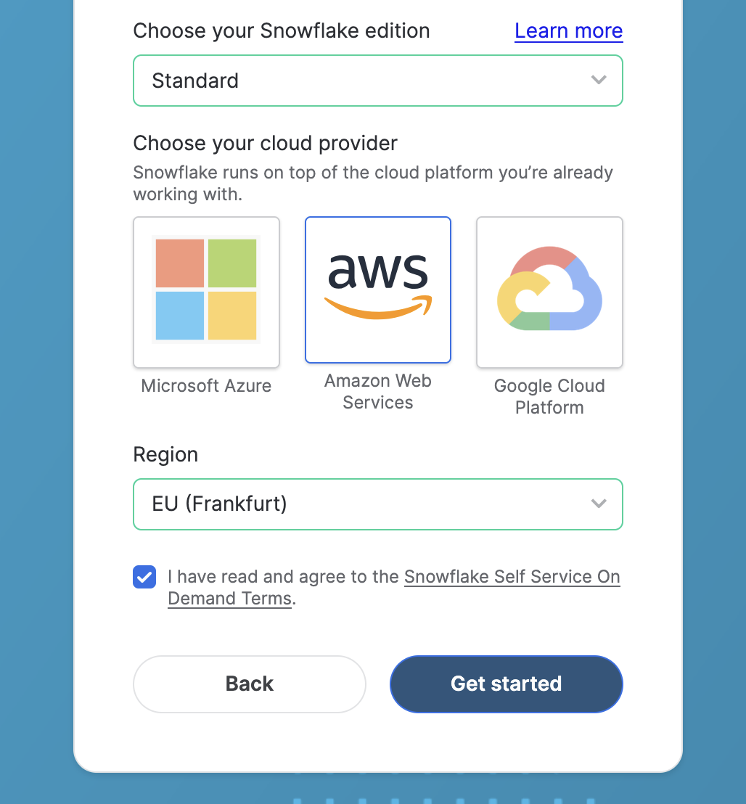
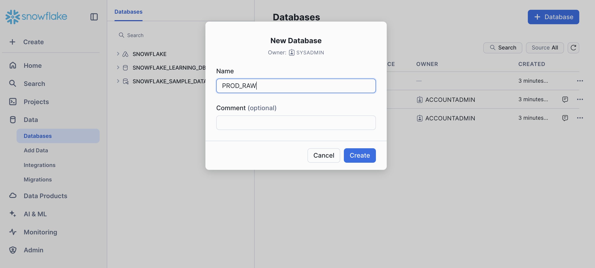
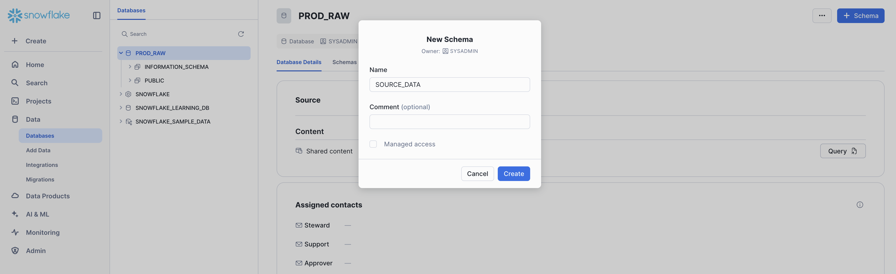
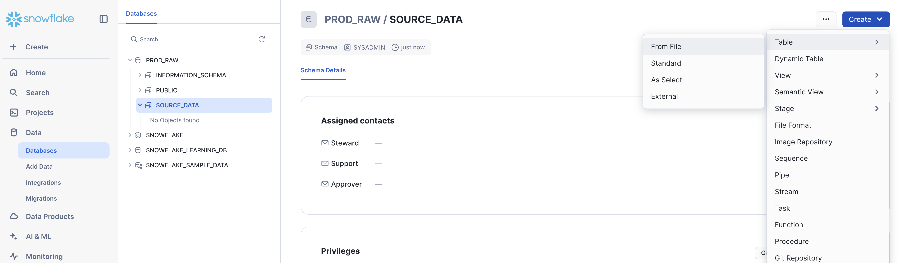
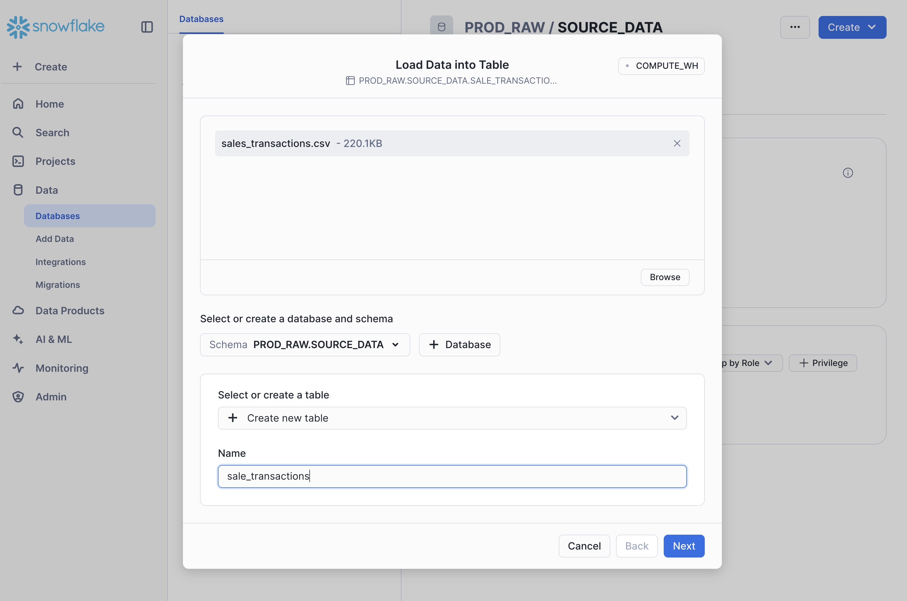
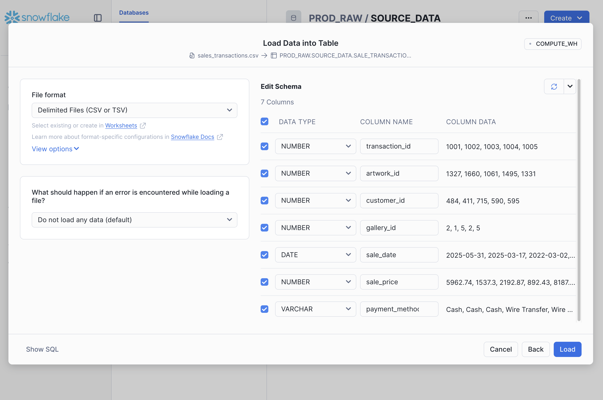
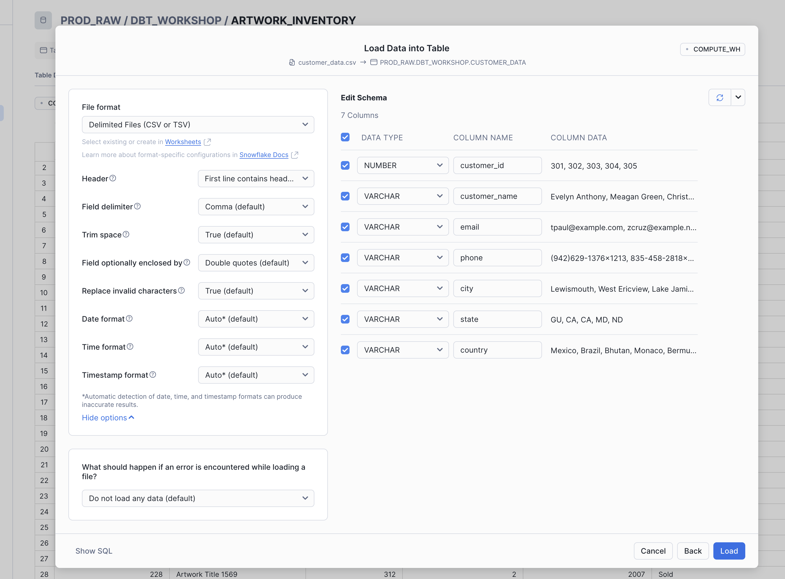

# Workshop requirements setup

These setup instructions will guide you through the core steps required to use dbt Core with Snowflake:
- Step 1. [Create a Snowflake trial account](#step-1-create-a-trial-account-with-snowflake)
- Step 2. [Create a PROD_RAW database in Snowflake and load sample data](#step-2-create-a-prod_raw-database-in-snowflake-and-load-sample-data)
- Step 3. [Install dbt Core locally](#step-3-install-dbt-core)
- Step 4. [Configure your dbt environment](#step-4-configure-your-dbt-environment)

## Step 1. Create a trial account with Snowflake

 - Go to the [Snowflake sign up page](https://signup.snowflake.com/) to create a trial account. The trial account is **valid for 30 days** and includes $400 worth of free usage. You new account should have the following settings:
    - Snowflake edition: Standard
    - Cloud provider: any cloud provider will work for this workshop
    - Region: any suitable region based on your location

  

 - Check your email for instructions on how to activate your account
 - Set your username and password to finalise account creation

## Step 2. Create a PROD_RAW database in Snowflake and load sample data

Now that your account is active, we need to load the source data that will be used in this workshop. The data sources in CSV format are stored in the [workshop/datasources](workshop/datasources) folder.

1. Start with creating a new database called **PROD_RAW** where we will store the source data. The easiest way to do that is by using the web UI:
 - Log in to your Snowflake account
 - In the sidebar, click the **Data** tab, then select **Databases**
 - Click the **+ Database** blue button in the top right corner
 - Enter **PROD_RAW** as the database name; add an optional description

  

2. Create a new schema in this database called **DBT_WORKSHOP**:
 - On the **PROD_RAW** database page, click the **+ Schema** blue button in the top right corner
 - In the **Create Schema** dialog, enter the desired schema name (**DBT_WORKSHOP**) and click the **Finish** button

   

3. Now let's load the source data to our new **DBT_WORKSHOP** schema:
 - Select the **PROD_RAW** database and **DBT_WORKSHOP** schema
 - Click the **Create** blue button in the top right corner, and select **Table** > **From File** option

   

 - In the new dialogue, select the CSV file to load into the table. We will need to create a table for each CSV file in the  `workshop/datasources/tables` folder.

 In the example below, we load `sales_transactions.csv`. After clicking **Next**, check the data types and column names for the new table. Once you are happy with the result, click **Load** to create the table and load the data into it.

   

   

If you want to change how Snowflake reads the CSV file, click **View options** link under the File format dropdown on the left, and make needed changes (for example, specify that the first line of the file contains header).

   

You can also click **Show SQL** option in the lower left corner of the dialogue box to see the set of SQL commands that Snwoflake will run to create the table and load the data.

## Step 3. Install dbt-core
- Prerequisites for all operating systems:
  - Python 3.7 or higher: Ensure Python is installed. Check with `python --version`. Download from [https://www.python.org](https://www.python.org) if needed.
  - pip: Usually comes installed with Python. Verify with `pip --version`.

 - It's recommended to create a Python virtual environment. For example, the command below creates a virtual environment called **dbt-env**:

   ```bash
   python -m venv dbt-env
   ```

   Once created, activate the virtual environment:
   On Windows
   ```bash
   dbt-env\Scripts\activate
   ```
   On Mac/Linux:
   ```bash
   source dbt-env/bin/activate
   ```
 - The final step is to install dbt and Snowflake adapter:

   ```bash
   pip install dbt-core dbt-snowflake
   ```
   Run the following command to confirm that dbt was installed correctly:

   ```bash
   dbt --version
   ```

  Here is the [dbt core + Snowflake documentation](https://docs.getdbt.com/docs/core/connect-data-platform/snowflake-setup#user--password-authentication) for more details.


## Step 4. Configure your dbt Environment

For this workshop, we'll set up a local profiles.yml file to connect to Snowflake. This project includes a pre-configured `profiles.yml` file located in the `workshop/gallery_project/dbt_profiles/profiles.yml` directory. This means that you only need to update your `.env` file with correct credentials.

We'll use environment variables to securely manage our Snowflake connection details. This approach prevents sensitive information from being stored directly in configuration files.

1. Create a `.env` file in the project root (workshop/gallery_project) to store your environment variables:

   ```bash
   touch .env
   ```

2. Add your Snowflake connection details to the `.env` file (replace with your actual values):

  ```bash
  export DBT_PROFILES_DIR=dbt_profiles
  export SNOWFLAKE_ACCOUNT_ID='your-account-id'  # e.g., xy12345.us-east-1
  export SNOWFLAKE_USERNAME='your-username'
  export SNOWFLAKE_PASSWORD='your-password'
  export USER_ROLE='SYSADMIN'
  export DATABASE='DEV_BRONZE'
  export WAREHOUSE='COMPUTE_WH'
  export SCHEMA='DBT_DEV'
  ```

See details on how to find your Snowflake account ID [here](https://docs.getdbt.com/docs/core/connect-data-platform/snowflake-setup#account).

  > **Important**: Never commit the `.env` file to version control. Add it to your `.gitignore` file to prevent accidental commits.

3. Load the environment variables:

  **On macOS/Linux:**
  ```bash
  source .env
  ```

  **On Windows (Command Prompt):**
  ```cmd
  set DBT_PROFILES_DIR=dbt_profiles
  set SNOWFLAKE_ACCOUNT_ID=your-account-id
  set SNOWFLAKE_USERNAME=your-username
  set SNOWFLAKE_PASSWORD=your-password
  set USER_ROLE=SYSADMIN
  set DATABASE=DEV_BRONZE
  set WAREHOUSE=COMPUTE_WH
  set SCHEMA=DBT_DEV
  ```

  **On Windows (PowerShell):**
  ```powershell
  $env:DBT_PROFILES_DIR="dbt_profiles"
  $env:SNOWFLAKE_ACCOUNT_ID="your-account-id"
  $env:SNOWFLAKE_USERNAME="your-username"
  $env:SNOWFLAKE_PASSWORD="your-password"
  $env:USER_ROLE="SYSADMIN"
  $env:DATABASE="DEV_BRONZE"
  $env:WAREHOUSE="COMPUTE_WH"
  $env:SCHEMA="DBT_DEV"
  ```

4. Test your connection to Snowflake:

  ```bash
  dbt debug
  ```

The `DBT_PROFILES_DIR` environment variable tells dbt to look for the profiles.yml file in the `dbt_profiles` directory instead of the default location (`~/.dbt/`).

If the connection is successful, you should see "Connection test: OK" in the output. This confirms that dbt can connect to your Snowflake account using the environment variables.

Now you're ready for the workshop!
